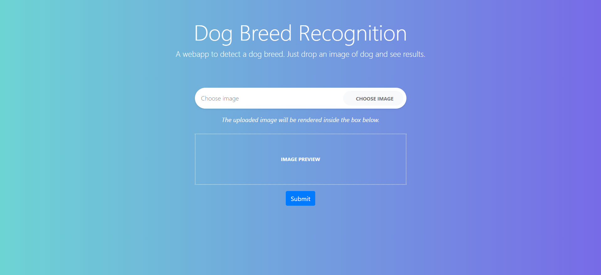
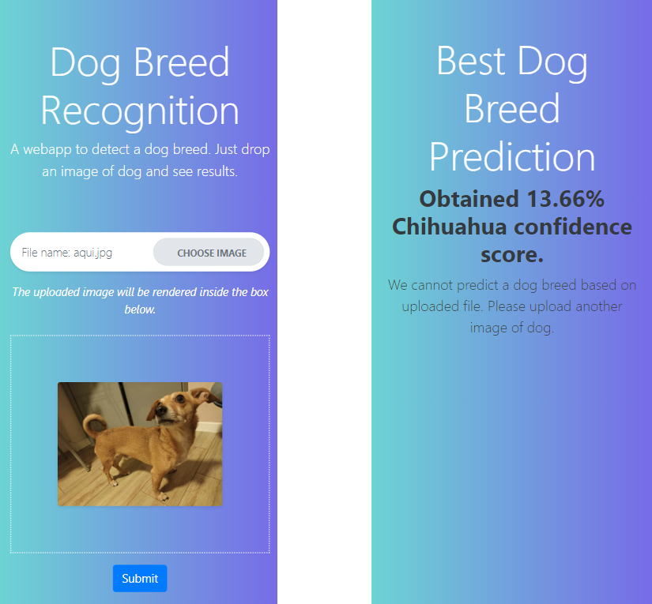
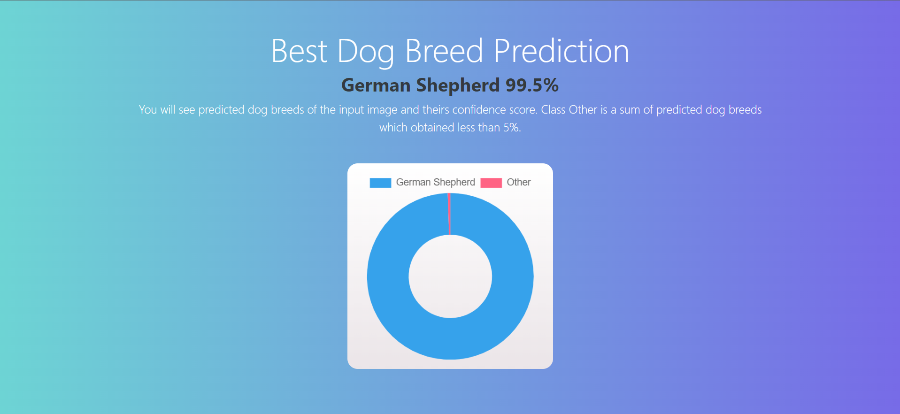
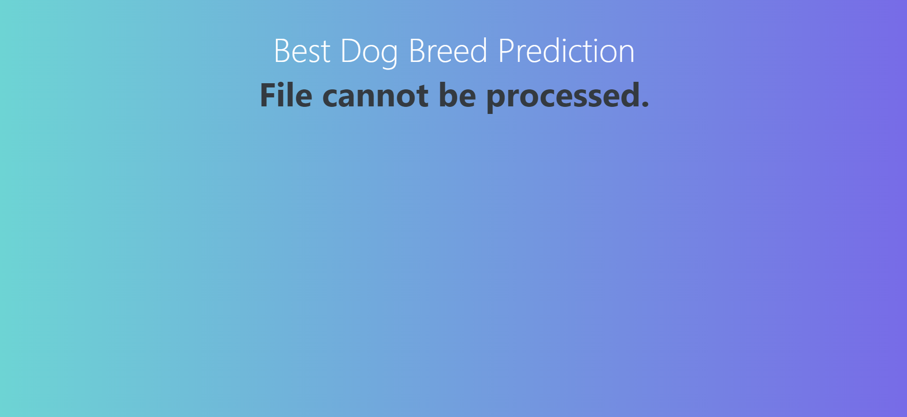
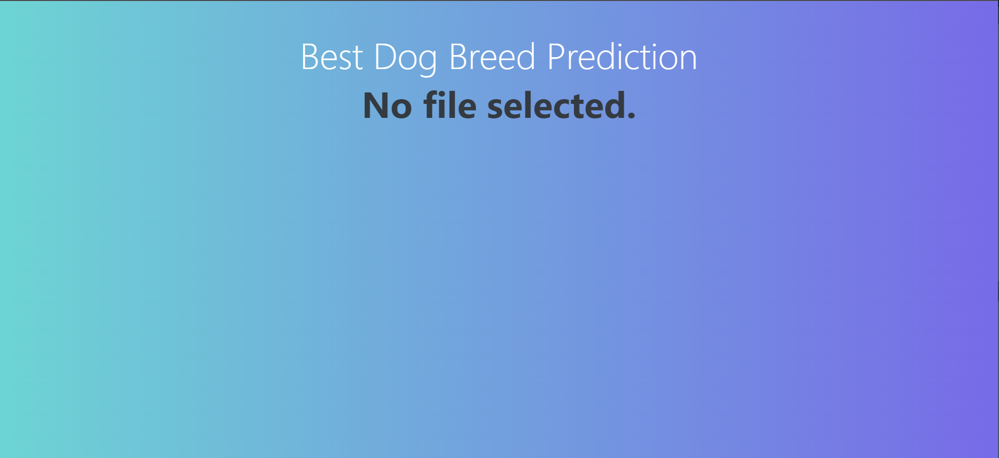

## Dog Breed Recognition
As part of our engineering work, we conducted image analysis in order to automatically indentify a specific type of object. For this purpose we used Kaggle
platform, where training of the dog breed recognition model was carried out using
convolutional networks. Then, the constructed model was successfully implemented
as a web application using the Flask framework. Thanks to this integration, it is possible to effectively recognize dog breeds using interactive web interface. This work
provides a comprehensive approach to image analysis and model implementation in
practical use.

### Team
- [joanbod](https://github.com/joanbod) - Planning the construction of the model. Support in implementation of the model. Application implementation: adding styles, uploading files, handling prediction.
- [majkel99](https://github.com/majkel99) - Data preparation and preprocessing. Model implementation: construction of model layers, testing.

### Examples
The main functionality of the application is to provide a tool for recognition of dog breeds using interactive web interface.

Home page with a form to upload a photo:

Presentation of the page on a smartphone screen with an uploaded photo:

Example of a prediction page:

Error message if file uploaded with invalid extension:

Error message if file is not selected:

### Technology
- tensorflow, 
- kaggle,
- flask,
- Bootstrap.
